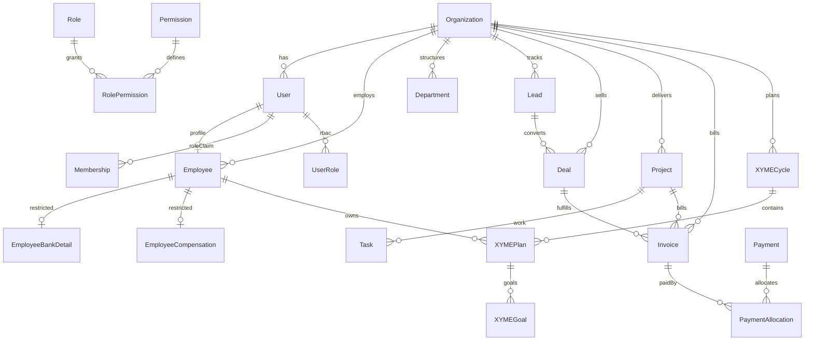

# Peacock One database model

Normalized PostgreSQL schema managed by Prisma (multi-file under `prisma/schema`).

## Conventions

- **Tenant scope:** most business tables include `organizationId`.
- **Money:** integer minor units (`*Minor`) + ISO `currencyCode` (`CHAR(3)`).
- **Time:** UTC `DateTime`; org timezone for display.
- **Soft delete:** `deletedAt` on important records.
- **IDs:** CUID strings.
- **Statuses:** configurable status tables (e.g. `LeadStatus`) where values may evolve; enums only for stable sets.
- **Sensitive HR/finance:** `EmployeeBankDetail`, `EmployeeTaxInformation`, `EmployeeCompensation`, and cost/CTC fields are isolated from ordinary employee list/detail selects.
- **Auth.js:** `User`, `Account`, `Session`, `VerificationToken` retained; `Membership` retained for session role claims; full RBAC via `Role` / `Permission` / `UserRole`.

## Entity counts

- Models: **195**
- Enums: **14**

## Domain map

### Organization

`Organization`, `OrganizationSettings`, `OfficeLocation`, `FinancialYear`, `Department`, `Team`, `JobRole`, `Designation`

### Identity / RBAC / Employees

`User`, `Account`, `Session`, `VerificationToken`, `UserSession`, `Membership`, `UserProfile`, `Role`, `Permission`, `RolePermission`, `UserRole`, `UserPermissionOverride`, `NotificationPreference`, `AuditLog`, `Employee`, `EmployeeManagerHistory`, `EmployeeDepartmentHistory`, `EmergencyContact`, `EmployeeBankDetail`, `EmployeeTaxInformation`

### CRM

`LeadSource`, `LeadStatus`, `Pipeline`, `PipelineStage`, `Tag`, `LostReason`, `Competitor`, `Campaign`, `ReferralPartner`, `ClientIndustry`, `ClientCompany`, `ClientAddress`, `Contact`, `ServiceOffering`, `Lead`, `LeadStageHistory`, `LeadAssignmentHistory`, `LeadActivity`, `CallLog`, `Meeting`, `Note`, `EmailActivity`, `FollowUp`, `LeadTag`, `CampaignLead`, `Deal`, `DealStageHistory`, `DealProduct`

### Company progress & XYME

`Objective`, `KeyResult`, `ObjectiveOwner`, `ObjectiveUpdate`, `KPI`, `KPIValue`, `CompanyTarget`, `DepartmentTarget`, `Milestone`, `Initiative`, `BusinessReview`, `RiskRegister`, `RiskUpdate`, `Issue`, `DecisionLog`, `XYMECycle`, `XYMEWeightConfiguration`, `XYMEPlan`, `XYMEGoal`, `XYMEGoalUpdate`, `XYMEApproval`, `XYMECheckIn`, `XYMEEvidence`, `XYMEComment`, `XYMEScore`

### Sales economics

`EmployeeMonthlyCost`, `RevenueAttributionRule`, `EmployeeRevenueAttribution`, `SalesTarget`, `SalesAchievement`, `SalesCommissionPlan`, `SalesCommissionRecord`, `EmployeeProfitabilitySnapshot`, `EmployeeHealthStatusHistory`

### HRMS

`Shift`, `ShiftAssignment`, `Holiday`, `AttendanceRecord`, `AttendanceCorrectionRequest`, `LeaveType`, `LeaveBalance`, `LeaveRequest`, `LeaveApproval`, `WorkFromHomeRequest`, `RegularizationRequest`, `DocumentType`, `EmployeeDocument`, `Policy`, `PolicyAcknowledgement`, `Announcement`, `RecruitmentJob`, `Candidate`, `CandidateApplication`, `Interview`, `InterviewFeedback`, `Offer`, `OnboardingChecklist`, `OnboardingTask`, `OffboardingChecklist`, `OffboardingTask`, `CompanyAsset`, `AssetAssignment`, `AssetMaintenance`, `SalaryComponent`, `EmployeeCompensation`, `EmployeeSalaryComponent`, `PayrollPeriod`, `Payslip`, `ReimbursementRequest`, `ReimbursementItem`

### Finance & invoicing

`Currency`, `ExchangeRate`, `TaxRate`, `Quote`, `QuoteItem`, `QuoteVersion`, `Invoice`, `InvoiceItem`, `InvoiceStatusHistory`, `CreditNote`, `Payment`, `PaymentAllocation`, `PaymentReminder`, `RecurringInvoiceTemplate`, `ExpenseCategory`, `Expense`, `ExpenseApproval`, `Vendor`, `VendorContact`, `PurchaseOrder`, `PurchaseOrderItem`, `VendorBill`, `VendorPayment`, `FinancialAttachment`

### Agency ERP

`ClientAccount`, `Retainer`, `Contract`, `StatementOfWork`, `ServiceCatalog`, `Project`, `ProjectService`, `ProjectMember`, `ProjectPhase`, `ProjectMilestone`, `Deliverable`, `DeliverableVersion`, `DeliverableApproval`, `Task`, `TaskDependency`, `TaskComment`, `TaskAttachment`, `TimeEntry`, `ResourceAllocation`, `CapacityPlan`, `ProjectBudget`, `ProjectCost`, `ProjectRevenue`, `ProjectProfitabilitySnapshot`, `ChangeRequest`, `ClientFeedback`, `QualityChecklist`, `QualityReview`

### Shared platform

`FileAttachment`, `Comment`, `Mention`, `ActivityFeed`, `ApprovalRequest`, `ApprovalStep`, `ApprovalAction`, `Notification`, `SavedView`, `CustomFieldDefinition`, `CustomFieldValue`, `ImportJob`, `ExportJob`, `WebhookEndpoint`, `IntegrationCredentialReference`, `ScheduledJob`, `SystemSetting`

## Core relationship overview

## Sensitive data boundaries

| Area                 | Tables / fields                                                 | Access rule                                       |
| -------------------- | --------------------------------------------------------------- | ------------------------------------------------- |
| Bank                 | `EmployeeBankDetail`                                            | `employees:view_compensation` only                |
| Tax                  | `EmployeeTaxInformation`                                        | `employees:view_compensation` only                |
| Salary               | `EmployeeCompensation`, `EmployeeSalaryComponent`, `Payslip`    | finance/HR compensation permissions               |
| Cost/CTC on employee | `monthlyEmploymentCostMinor`, `annualCtcMinor`                  | omitted from ordinary employee repository selects |
| Profitability        | `EmployeeProfitabilitySnapshot`, `ProjectProfitabilitySnapshot` | `finance:view_profitability`                      |

## Migrations

- Location: `prisma/schema/migrations` (paired with multi-file schema folder)
- Initial platform migration: `20260719180000_full_platform_schema`

## Full model index

- `Organization` — Organization
- `OrganizationSettings` — Organization
- `OfficeLocation` — Organization
- `FinancialYear` — Organization
- `Department` — Organization
- `Team` — Organization
- `JobRole` — Organization
- `Designation` — Organization
- `User` — Identity / RBAC / Employees
- `Account` — Identity / RBAC / Employees
- `Session` — Identity / RBAC / Employees
- `VerificationToken` — Identity / RBAC / Employees
- `UserSession` — Identity / RBAC / Employees
- `Membership` — Identity / RBAC / Employees
- `UserProfile` — Identity / RBAC / Employees
- `Role` — Identity / RBAC / Employees
- `Permission` — Identity / RBAC / Employees
- `RolePermission` — Identity / RBAC / Employees
- `UserRole` — Identity / RBAC / Employees
- `UserPermissionOverride` — Identity / RBAC / Employees
- `NotificationPreference` — Identity / RBAC / Employees
- `AuditLog` — Identity / RBAC / Employees
- `Employee` — Identity / RBAC / Employees
- `EmployeeManagerHistory` — Identity / RBAC / Employees
- `EmployeeDepartmentHistory` — Identity / RBAC / Employees
- `EmergencyContact` — Identity / RBAC / Employees
- `EmployeeBankDetail` — Identity / RBAC / Employees
- `EmployeeTaxInformation` — Identity / RBAC / Employees
- `LeadSource` — CRM
- `LeadStatus` — CRM
- `Pipeline` — CRM
- `PipelineStage` — CRM
- `Tag` — CRM
- `LostReason` — CRM
- `Competitor` — CRM
- `Campaign` — CRM
- `ReferralPartner` — CRM
- `ClientIndustry` — CRM
- `ClientCompany` — CRM
- `ClientAddress` — CRM
- `Contact` — CRM
- `ServiceOffering` — CRM
- `Lead` — CRM
- `LeadStageHistory` — CRM
- `LeadAssignmentHistory` — CRM
- `LeadActivity` — CRM
- `CallLog` — CRM
- `Meeting` — CRM
- `Note` — CRM
- `EmailActivity` — CRM
- `FollowUp` — CRM
- `LeadTag` — CRM
- `CampaignLead` — CRM
- `Deal` — CRM
- `DealStageHistory` — CRM
- `DealProduct` — CRM
- `Objective` — Company progress & XYME
- `KeyResult` — Company progress & XYME
- `ObjectiveOwner` — Company progress & XYME
- `ObjectiveUpdate` — Company progress & XYME
- `KPI` — Company progress & XYME
- `KPIValue` — Company progress & XYME
- `CompanyTarget` — Company progress & XYME
- `DepartmentTarget` — Company progress & XYME
- `Milestone` — Company progress & XYME
- `Initiative` — Company progress & XYME
- `BusinessReview` — Company progress & XYME
- `RiskRegister` — Company progress & XYME
- `RiskUpdate` — Company progress & XYME
- `Issue` — Company progress & XYME
- `DecisionLog` — Company progress & XYME
- `XYMECycle` — Company progress & XYME
- `XYMEWeightConfiguration` — Company progress & XYME
- `XYMEPlan` — Company progress & XYME
- `XYMEGoal` — Company progress & XYME
- `XYMEGoalUpdate` — Company progress & XYME
- `XYMEApproval` — Company progress & XYME
- `XYMECheckIn` — Company progress & XYME
- `XYMEEvidence` — Company progress & XYME
- `XYMEComment` — Company progress & XYME
- `XYMEScore` — Company progress & XYME
- `EmployeeMonthlyCost` — Sales economics
- `RevenueAttributionRule` — Sales economics
- `EmployeeRevenueAttribution` — Sales economics
- `SalesTarget` — Sales economics
- `SalesAchievement` — Sales economics
- `SalesCommissionPlan` — Sales economics
- `SalesCommissionRecord` — Sales economics
- `EmployeeProfitabilitySnapshot` — Sales economics
- `EmployeeHealthStatusHistory` — Sales economics
- `Shift` — HRMS
- `ShiftAssignment` — HRMS
- `Holiday` — HRMS
- `AttendanceRecord` — HRMS
- `AttendanceCorrectionRequest` — HRMS
- `LeaveType` — HRMS
- `LeaveBalance` — HRMS
- `LeaveRequest` — HRMS
- `LeaveApproval` — HRMS
- `WorkFromHomeRequest` — HRMS
- `RegularizationRequest` — HRMS
- `DocumentType` — HRMS
- `EmployeeDocument` — HRMS
- `Policy` — HRMS
- `PolicyAcknowledgement` — HRMS
- `Announcement` — HRMS
- `RecruitmentJob` — HRMS
- `Candidate` — HRMS
- `CandidateApplication` — HRMS
- `Interview` — HRMS
- `InterviewFeedback` — HRMS
- `Offer` — HRMS
- `OnboardingChecklist` — HRMS
- `OnboardingTask` — HRMS
- `OffboardingChecklist` — HRMS
- `OffboardingTask` — HRMS
- `CompanyAsset` — HRMS
- `AssetAssignment` — HRMS
- `AssetMaintenance` — HRMS
- `SalaryComponent` — HRMS
- `EmployeeCompensation` — HRMS
- `EmployeeSalaryComponent` — HRMS
- `PayrollPeriod` — HRMS
- `Payslip` — HRMS
- `ReimbursementRequest` — HRMS
- `ReimbursementItem` — HRMS
- `Currency` — Finance & invoicing
- `ExchangeRate` — Finance & invoicing
- `TaxRate` — Finance & invoicing
- `Quote` — Finance & invoicing
- `QuoteItem` — Finance & invoicing
- `QuoteVersion` — Finance & invoicing
- `Invoice` — Finance & invoicing
- `InvoiceItem` — Finance & invoicing
- `InvoiceStatusHistory` — Finance & invoicing
- `CreditNote` — Finance & invoicing
- `Payment` — Finance & invoicing
- `PaymentAllocation` — Finance & invoicing
- `PaymentReminder` — Finance & invoicing
- `RecurringInvoiceTemplate` — Finance & invoicing
- `ExpenseCategory` — Finance & invoicing
- `Expense` — Finance & invoicing
- `ExpenseApproval` — Finance & invoicing
- `Vendor` — Finance & invoicing
- `VendorContact` — Finance & invoicing
- `PurchaseOrder` — Finance & invoicing
- `PurchaseOrderItem` — Finance & invoicing
- `VendorBill` — Finance & invoicing
- `VendorPayment` — Finance & invoicing
- `FinancialAttachment` — Finance & invoicing
- `ClientAccount` — Agency ERP
- `Retainer` — Agency ERP
- `Contract` — Agency ERP
- `StatementOfWork` — Agency ERP
- `ServiceCatalog` — Agency ERP
- `Project` — Agency ERP
- `ProjectService` — Agency ERP
- `ProjectMember` — Agency ERP
- `ProjectPhase` — Agency ERP
- `ProjectMilestone` — Agency ERP
- `Deliverable` — Agency ERP
- `DeliverableVersion` — Agency ERP
- `DeliverableApproval` — Agency ERP
- `Task` — Agency ERP
- `TaskDependency` — Agency ERP
- `TaskComment` — Agency ERP
- `TaskAttachment` — Agency ERP
- `TimeEntry` — Agency ERP
- `ResourceAllocation` — Agency ERP
- `CapacityPlan` — Agency ERP
- `ProjectBudget` — Agency ERP
- `ProjectCost` — Agency ERP
- `ProjectRevenue` — Agency ERP
- `ProjectProfitabilitySnapshot` — Agency ERP
- `ChangeRequest` — Agency ERP
- `ClientFeedback` — Agency ERP
- `QualityChecklist` — Agency ERP
- `QualityReview` — Agency ERP
- `FileAttachment` — Shared platform
- `Comment` — Shared platform
- `Mention` — Shared platform
- `ActivityFeed` — Shared platform
- `ApprovalRequest` — Shared platform
- `ApprovalStep` — Shared platform
- `ApprovalAction` — Shared platform
- `Notification` — Shared platform
- `SavedView` — Shared platform
- `CustomFieldDefinition` — Shared platform
- `CustomFieldValue` — Shared platform
- `ImportJob` — Shared platform
- `ExportJob` — Shared platform
- `WebhookEndpoint` — Shared platform
- `IntegrationCredentialReference` — Shared platform
- `ScheduledJob` — Shared platform
- `SystemSetting` — Shared platform
