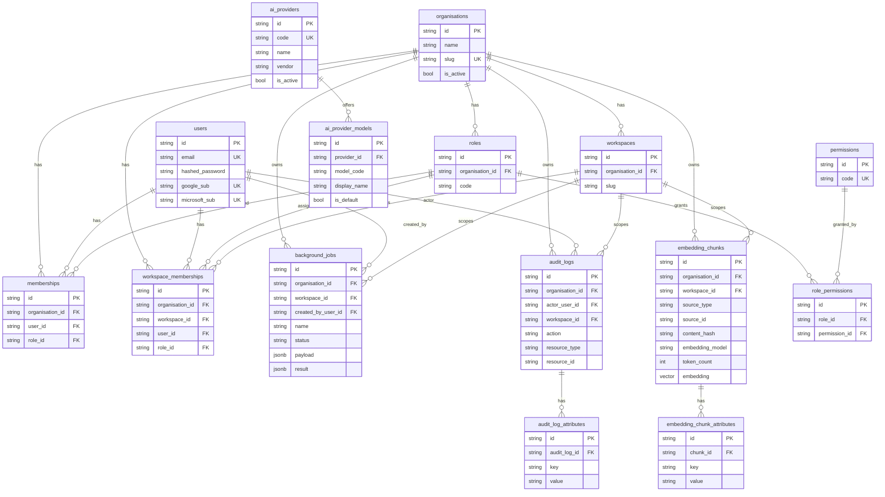

# Entity-relationship diagram (Peacock One)

Relational schema for the architecture stage. Embeddings use **pgvector** inside PostgreSQL.

## Cascade policy (careful defaults)

| Child | Parent | ON DELETE | Rationale |
| --- | --- | --- | --- |
| `workspaces` | `organisations` | **CASCADE** | Workspace cannot outlive its tenant |
| `roles` | `organisations` | **CASCADE** | Org-scoped roles |
| `memberships` | `organisations` | **CASCADE** | Tenant membership |
| `memberships` | `users` | **CASCADE** | Remove membership when user is deleted |
| `memberships` | `roles` | **RESTRICT** | Do not delete a role still assigned to users |
| `workspace_memberships` | `organisations` / `workspaces` / `users` | **CASCADE** | Pure join ownership |
| `workspace_memberships` | `roles` | **RESTRICT** | Protect in-use roles |
| `role_permissions` | `roles` / `permissions` | **CASCADE** | Join rows are disposable |
| `background_jobs` | `organisations` | **CASCADE** | Tenant wipe |
| `background_jobs` | `workspaces` | **SET NULL** | Preserve job history if workspace removed |
| `background_jobs` | `users` (creator) | **SET NULL** | Preserve job history if user removed |
| `audit_logs` | `organisations` | **CASCADE** | Tenant wipe |
| `audit_logs` | `users` (actor) | **SET NULL** | Keep audit row; anonymise actor |
| `audit_logs` | `workspaces` | **SET NULL** | Keep audit row |
| `audit_log_attributes` | `audit_logs` | **CASCADE** | Attributes owned by the log |
| `embedding_chunks` | `organisations` | **CASCADE** | Tenant wipe |
| `embedding_chunks` | `workspaces` | **SET NULL** | Keep chunk if workspace removed |
| `embedding_chunk_attributes` | `embedding_chunks` | **CASCADE** | Attributes owned by the chunk |
| `ai_provider_models` | `ai_providers` | **CASCADE** | Catalog hierarchy |

## JSONB policy

JSONB is used **only** where the shape is genuinely job-specific and heterogeneous:

- `background_jobs.payload`
- `background_jobs.result`

Everything else that looks like “metadata” is modelled relationally:

- `audit_log_attributes (audit_log_id, key, value)`
- `embedding_chunk_attributes (chunk_id, key, value)`
- Structured columns on `embedding_chunks`: `content_hash`, `embedding_model`, `token_count`
- `ai_provider_models` instead of a JSON array of models on the provider

## Mermaid ERD

## Seeded AI providers

| Code | Display name | Vendor |
| --- | --- | --- |
| `openai` | OpenAI | OpenAI |
| `gemini` | Gemini | Google |
| `anthropic` | Claude | Anthropic |
| `perplexity` | Perplexity | Perplexity |
| `deepseek` | DeepSeek | DeepSeek |

Seeded via `infra/scripts/seed_dev.py` using `db_models.provider_seed.SUPPORTED_AI_PROVIDERS`.
