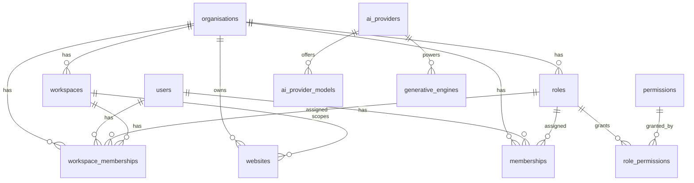
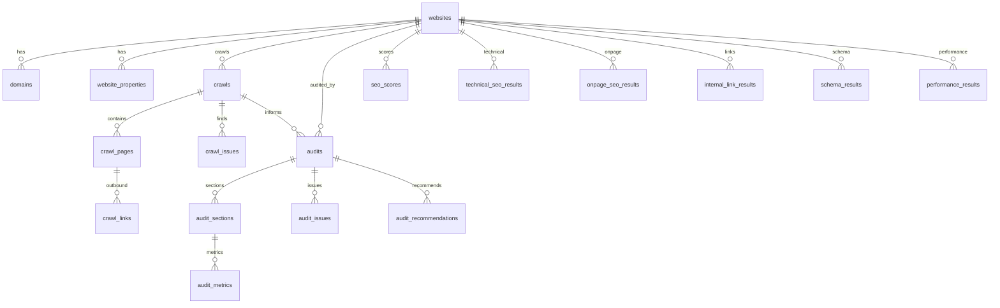
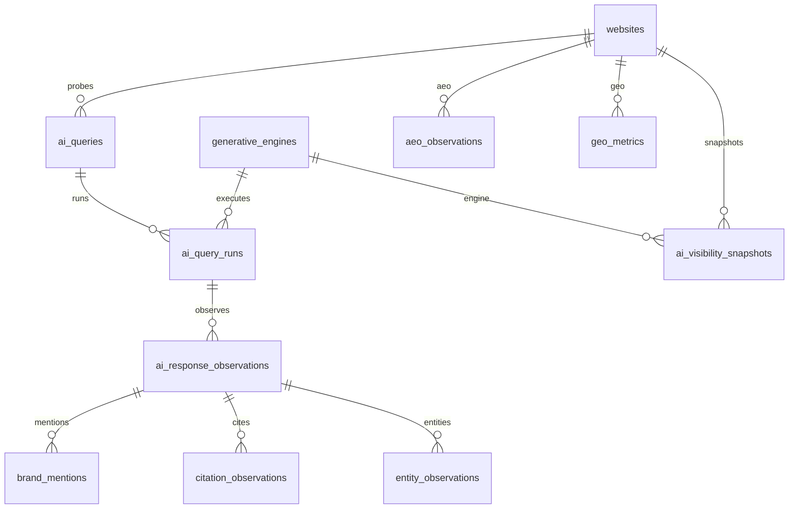
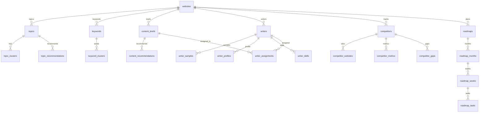
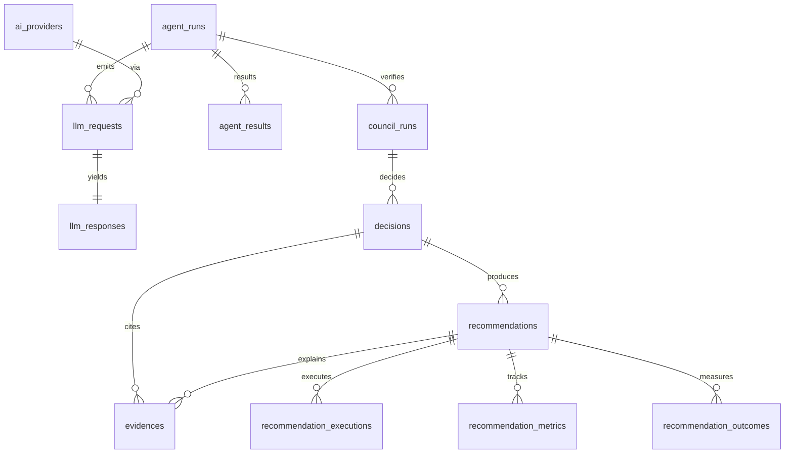
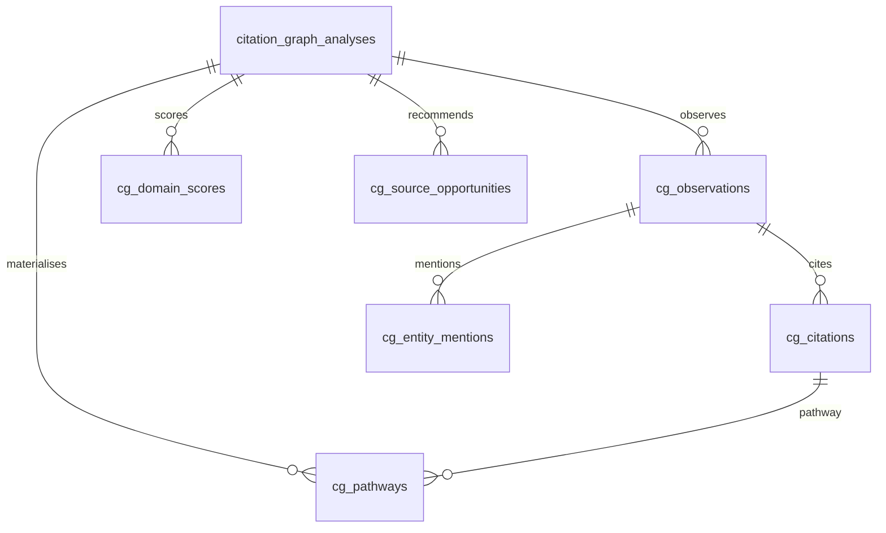

# Entity-relationship diagram (Peacock One)

Enterprise multi-tenant core schema for SEO + AEO + GEO visibility intelligence.
Embeddings use **pgvector** inside PostgreSQL. IDs are UUID strings (`String(36)`).

## Tenancy conventions

Important tenant-scoped records use `WorkspaceTenantMixin`:

| Field | Notes |
| --- | --- |
| `id` | UUID PK |
| `organisation_id` | FK → `organisations.id` **ON DELETE CASCADE** |
| `workspace_id` | FK → `workspaces.id` **ON DELETE CASCADE** |
| `created_by` | FK → `users.id` **ON DELETE SET NULL** (optional) |
| `status` | Indexed lifecycle string |
| `created_at` / `updated_at` | Timezone-aware timestamps |

Child rows often denormalize `organisation_id` / `workspace_id` for isolation queries without deep joins.
British spelling **organisation** is canonical; `Organization` is an import alias.

`AIVisibilitySnapshot` is a single table (`ai_visibility_snapshots`) shared by GEO/AEO and monitoring.
`RecommendationOutcome` lives in the learning domain; monitoring links via recommendations.

## Cascade policy (careful defaults)

| Child | Parent | ON DELETE | Rationale |
| --- | --- | --- | --- |
| `workspaces` | `organisations` | **CASCADE** | Workspace cannot outlive its tenant |
| `roles` | `organisations` | **CASCADE** | Org-scoped roles |
| `memberships` | `organisations` / `users` | **CASCADE** | Tenant membership |
| `memberships` / `workspace_memberships` | `roles` | **RESTRICT** | Do not delete an in-use role |
| `websites` and most domain entities | org / workspace | **CASCADE** | Tenant wipe |
| Crawl/audit/roadmap children | parent aggregate | **CASCADE** | Owned hierarchy |
| `crawl_links.to_page_id` | `crawl_pages` | **SET NULL** | Preserve link if target page removed |
| `ai_query_runs` | `generative_engines` | **RESTRICT** | Protect catalog engines in use |
| `llm_requests` | `ai_providers` | **RESTRICT** | Protect provider catalog in use |
| `llm_requests.agent_run_id` | `agent_runs` | **SET NULL** | Keep ledger if run pruned |
| `background_jobs` | org | **CASCADE**; workspace/user **SET NULL** | Preserve history when possible |
| `audit_logs` | org **CASCADE**; actor/workspace **SET NULL** | Keep audit trail |
| `generative_engines.llm_provider_id` | `ai_providers` | **SET NULL** | Engines may outlive provider link |
| Domain recommendation bridges | central `recommendations` | **SET NULL** | Keep local copy if central row removed |

## JSONB policy

JSONB is used **only** where shape is genuinely heterogeneous:

| Table.column | Why JSONB |
| --- | --- |
| `background_jobs.payload` / `result` | Per-job contracts differ by job name |
| `crawls.config` | Crawl engine knobs vary by version |
| `llm_requests.messages` | Role-bound message arrays differ by adapter |
| `websites.extensions` | Sparse product flags only — typed settings use `website_properties` |

Everything else is relational columns, unique constraints, or EAV attribute tables
(`audit_log_attributes`, `embedding_chunk_attributes`, `website_properties`).

## Domain inventory

| Domain | Tables |
| --- | --- |
| Identity | `organisations`, `users`, `workspaces`, `roles`, `permissions`, `role_permissions`, `memberships`, `workspace_memberships` |
| Platform | `ai_providers`, `ai_provider_models`, `background_jobs`, `audit_logs`, `audit_log_attributes`, `embedding_chunks`, `embedding_chunk_attributes` |
| Websites | `websites`, `domains`, `website_properties` |
| Crawls | `crawls`, `crawl_pages`, `crawl_links`, `crawl_issues` |
| Audits | `audits`, `audit_sections`, `audit_metrics`, `audit_issues`, `audit_recommendations` |
| SEO | `seo_scores`, `technical_seo_results`, `onpage_seo_results`, `internal_link_results`, `schema_results`, `performance_results` |
| GEO/AEO | `generative_engines`, `ai_queries`, `ai_query_runs`, `ai_response_observations`, `brand_mentions`, `citation_observations`, `entity_observations`, `aeo_observations`, `geo_metrics`, `ai_visibility_snapshots` |
| Competitors | `competitors`, `competitor_websites`, `competitor_metrics`, `competitor_contents`, `competitor_gaps` |
| Content | `topics`, `topic_clusters`, `topic_recommendations`, `keywords`, `keyword_clusters`, `content_briefs`, `content_recommendations`, `backlink_opportunities`, `citation_sources` |
| Writers | `writers`, `writer_samples`, `writer_profiles`, `writer_skills`, `writer_industry_expertise`, `writer_performances`, `writer_recommendations`, `writer_assignments` |
| Roadmaps | `roadmaps`, `roadmap_months`, `roadmap_weeks`, `roadmap_tasks`, `roadmap_recommendations` |
| Monitoring | `monitoring_projects`, `metric_snapshots`, `search_performance_snapshots` |
| LLM intelligence | `llm_requests`, `llm_responses`, `agent_runs`, `agent_results`, `council_runs`, `decisions`, `evidences` |
| PINE IntelligenceCase | `intelligence_cases`, `intelligence_case_context_items`, `intelligence_case_observations`, `intelligence_case_evidence`, `intelligence_case_evidence_urls`, `intelligence_case_hypotheses`, `intelligence_case_agent_findings`, `intelligence_case_agent_claims`, `intelligence_case_contradictions`, `intelligence_case_unknowns`, `intelligence_case_assumptions`, `intelligence_case_risks`, `intelligence_case_opportunities`, `intelligence_case_recommendations`, `intelligence_case_recommendation_evidence`, `intelligence_case_models_used`, `intelligence_case_tools_used` |
| Evidence Ledger | `ledger_evidences`, `ledger_findings`, `ledger_recommendations`, `ledger_actions`, `ledger_outcomes`, `ledger_evidence_finding_links`, `ledger_finding_recommendation_links`, `ledger_recommendation_action_links`, `ledger_action_outcome_links`, `ledger_claim_evidence_links` |
| Capability profiles | `model_capability_priors`, `model_capability_profiles`, `model_capability_observations` |
| Probabilistic AI Visibility | `visibility_campaigns`, `visibility_probe_cells`, `visibility_probe_observations`, `visibility_distributions`, `visibility_score_cards` |
| Prompt Universe Intelligence | `prompt_universes`, `synthetic_personas`, `prompt_source_signals`, `prompt_families`, `universe_prompts`, `prompt_generation_runs` |
| Share of Answer | `share_of_answer_analyses`, `soa_answer_observations`, `soa_entity_indicators`, `soa_brand_scores` |
| Citation Graph | `citation_graph_analyses`, `cg_observations`, `cg_citations`, `cg_entity_mentions`, `cg_pathways`, `cg_domain_scores`, `cg_source_opportunities` |
| Retrieval Pathway Intelligence | `retrieval_pathway_analyses`, `rpi_evidence`, `rpi_cause_classifications`, `rpi_bottleneck_diagnoses` |
| Entity Intelligence | `entity_intelligence_analyses`, `ei_entities`, `ei_associations`, `ei_entity_gaps`, `ei_strategies` |
| Deep Competitor Intelligence | `deep_competitor_analyses`, `dc_competitor_profiles`, `dc_competitive_deltas`, `dc_content_diffs`, `dc_differentiated_strategies` |
| Content Lab | `content_lab_analyses`, `cl_content_proposals`, `cl_info_gain_signals`, `cl_citability_components` |
| Content Digital Twin | `content_digital_twins`, `cdt_evaluations`, `cdt_requirement_scores`, `cdt_findings` |
| Peacock GEO Lab | `geo_lab_experiments`, `gl_variants`, `gl_pages`, `gl_metric_observations`, `gl_metric_deltas`, `gl_causality_assessments` |
| Writer Intelligence 2.0 | `writer_intelligence_analyses`, `wi_writer_dna`, `wi_dna_traits`, `wi_outcome_nodes`, `wi_outcome_edges`, `wi_performance_records`, `wi_recommendations` |
| Peacock Opportunity Engine | `opportunity_scans`, `peacock_opportunities`, `po_evidence`, `po_ranking_factors`, `po_ranking_weights`, `po_outcome_feedback` |
| Peacock Council 2.0 | `council2_sessions`, `c2_agents`, `c2_round_records`, `c2_claims`, `c2_evidence`, `c2_counterarguments`, `c2_disagreements`, `c2_evidence_requests`, `c2_decisions` |
| Peacock Judge 2.0 | `judge2_judgments`, `j2_signal_scores`, `j2_evidence`, `j2_reversal_conditions` |
| Peacock Scenario Engine | `scenario_analyses`, `se_scenarios`, `se_metric_ranges`, `se_assumptions` |
| Peacock 90 2.0 | `peacock90_plans`, `p90_initiatives`, `p90_tasks`, `p90_dependencies`, `p90_capacity_refusals` |
| Peacock Action Engine | `peacock_actions`, `pae_connector_permissions`, `pae_approvals`, `pae_executions`, `pae_status_events` |
| Peacock Agentic Web Readiness | `agentic_readiness_analyses`, `awr_check_results`, `awr_gaps` |
| Peacock Revenue Attribution | `revenue_attribution_analyses`, `ra_funnel_stages`, `ra_chain_links`, `ra_source_snapshots` |
| Peacock Learning Engine 2.0 | `learning2_records`, `le2_context_factors`, `le2_industry_policies`, `le2_dimension_insights`, `le2_learning_runs` |
| Peacock Temporal Intelligence | `temporal_timelines`, `ti_timeline_events`, `ti_change_points`, `ti_query_answers` |
| Peacock Anomaly Engine | `anomaly_scans`, `ae_anomalies` |
| Ask Peacock 2.0 | `ask_peacock_sessions`, `ap_answers`, `ap_evidence` |
| Peacock Command Centre | `command_centre_snapshots`, `cc_visibility_signals`, `cc_situation_items`, `cc_feed_items` |
| Peacock Executive Brain | `executive_brain_briefs`, `eb_answers`, `eb_role_summaries` |
| Peacock Proprietary Metrics | `proprietary_metric_scorecards`, `pm_metric_scores`, `pm_metric_components` |
| Peacock Research Mode | `research_studies`, `rm_pages`, `rm_prompts`, `rm_observations`, `rm_findings` |
| Learning | `recommendations`, `recommendation_executions`, `recommendation_metrics`, `recommendation_outcomes`, `feature_weights`, `model_evaluations` |

Aliases: `Organization` → `Organisation`; `LLMProvider` → `AiProvider`; `LLMModel` → `AiProviderModel`.

## Mermaid — identity & platform

## Mermaid — website → crawl → audit → SEO

## Mermaid — GEO / AEO visibility

## Mermaid — content, writers, competitors, roadmaps

## Mermaid — LLM intelligence & learning loop

## Mermaid — Citation Graph

## Seeded AI providers

| Code | Display name | Vendor |
| --- | --- | --- |
| `openai` | OpenAI | OpenAI |
| `gemini` | Gemini | Google |
| `anthropic` | Claude | Anthropic |
| `perplexity` | Perplexity | Perplexity |
| `deepseek` | DeepSeek | DeepSeek |

Also seeded generative engines (`chatgpt`, `gemini`, `claude`, `perplexity`, `deepseek`, `google_ai_overview`) via `infra/scripts/seed_dev.py`.

## Migrations

| Revision | Purpose |
| --- | --- |
| `0001_initial` | Identity, jobs, audit logs, embeddings |
| `0002_org_fks` | Organisation FK hardening |
| `0003_relational_hardening` | Cascades, role_permissions, AI providers, attribute tables |
| `0004_core_domain_schema` (`9b7d51fd6b52`) | Full websites/crawls/audits/SEO/GEO/competitors/content/writers/roadmaps/monitoring/LLM/learning schema |
| `0011_share_of_answer` | Share of Answer multi-indicator generative influence |
| `0012_citation_graph` | Peacock Citation Graph, CIS, Source Opportunity Engine |
| `0013_retrieval_pathway` | Retrieval Pathway Intelligence forensics |
| `0014_entity_intelligence` | Peacock Entity Intelligence graph, association strength, gaps |
| `0015_deep_competitor` | Deep Competitor Intelligence multi-category discovery |
| `0016_content_lab` | Peacock Content Lab multi-opportunity evaluation |
| `0017_content_digital_twin` | Content Digital Twin pre-publish simulation |
| `0018_geo_lab` | Peacock GEO Lab controlled experimentation |
| `0019_writer_intelligence` | Writer Intelligence 2.0 DNA + outcome decision |
| `0020_opportunity_engine` | Peacock Opportunity Engine always-on layer |
| `0021_council2` | Peacock Council 2.0 opposing-role debate |
| `0022_judge2` | Peacock Judge 2.0 deterministic multi-signal judgment |
| `0023_scenario_engine` | Peacock Scenario Engine counterfactual strategy ranges |
| `0024_peacock90` | Peacock 90 2.0 adaptive roadmap optimisation |
| `0025_action_engine` | Peacock Action Engine approval-based execution |
| `0026_agentic_readiness` | Peacock Agentic Web Readiness / Agent Discoverability |
| `0027_revenue_attribution` | Peacock Revenue Attribution uncertain funnel chain |
| `0028_learning_engine2` | Peacock Learning Engine 2.0 closed-loop industry learning |
| `0029_temporal_intelligence` | Peacock Temporal Intelligence Visibility Timeline |
| `0030_anomaly_engine` | Peacock Anomaly Engine impact-ranked detection |
| `0031_ask_peacock` | Ask Peacock 2.0 structured NL intelligence-graph interface |
| `0032_command_centre` | Peacock Command Centre flagship visibility command surface |
| `0033_executive_brain` | Peacock Executive Brain CEO/CMO executive view |
| `0034_proprietary_metrics` | Peacock Proprietary Metrics documented scoring framework |
| `0035_research_mode` | Peacock Research Mode search intelligence laboratory |
| `0036_moat_data_model` | Peacock Moat Data Model proprietary pathway accumulation |
| `0037_cost_intelligence` | Peacock Cost Intelligence / Intelligence Budget Engine |
| `0038_enterprise_reliability` | Peacock Enterprise Reliability partial multi-provider controls |
| `0039_ai_connector_security` | Peacock Security for AI Connectors untrusted LLM I/O |
| `0040_quality_bar` | Peacock One Quality Bar module completeness gates |
